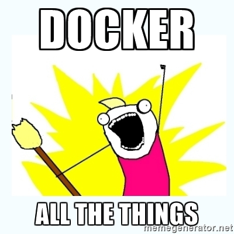
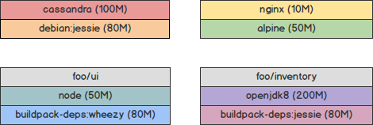
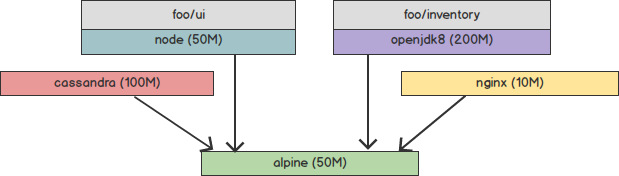
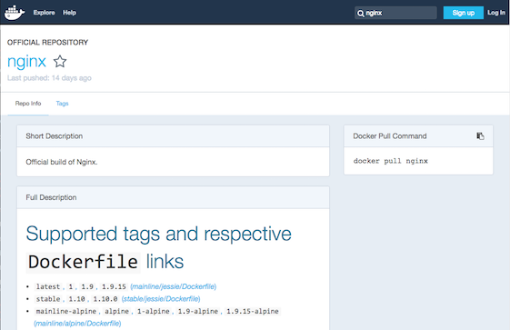

name: heading
layout: true
class: center, middle, inverse

---

# Building an Enterprise Product with Docker

## Maritime Devcon 2016
Chris Dail - [@chrisdail](http://twitter.com/chrisdail)

Director, Software Engineering at [EMC](http://www.emc.com)

---

layout: false

# Intro

Talk about my experience building an enterprise product with docker
- Lessons Learned
- Case Study
- How-To

--

"We" means the product team I work with

---

# Rewind, Maritime Devcon 2015

- Advantages of Microservices architecture
- Basics of Docker to achieve this architecture

---

template: heading
## Microservices Architecture

---

template: heading
## "Modern" architecture for Software as a Service

---

template: heading
## What About Enterprise Products

How to use microservices and docker for packaged products?

---

template: heading


---

template: heading

## Why Packaged Product?

To understand this, you need to understand what we built

---

# What We Built

- A Turnkey Private Cloud based on OpenStack
- Infrastructure: Hardware and Software
- Self-contained: Network switches, Compute servers with Storage (Hyper-converged)

---

template:heading
# Challenges for Self-Contained Enterprise Products

---

.left-column[
## Challenges
### - N different environments
]
.right-column[
- Multiple Customer Installation Sites
- Different Versions at Different Sites
- Robust Installation and Upgrade become important
]

---

.left-column[
## Challenges
### - N different environments
### - Dark Sites
]
.right-column[
- Limited or no Internet Access (Security Reasons)
  - Depending on customer networks
- Trusted Sites - Anything you need coming from a site you control (HTTPS)
  - OS Package Updates, etc
  - Imagine if you depend on npm repository for left-pad
]

---

.left-column[
## Challenges
### - N different environments
### - Dark Sites
### - No Dependencies
]
.right-column[
- Assume as little as possible about a customer environment
- Cannot depend on customer's private cloud or AWS
]

---

.left-column[
## Challenges
### - N different environments
### - Dark Sites
### - No Dependencies
### - Legal
]
.right-column[
- This is easy
```bash
docker run -v /data:/usr/share/nginx/html:ro -d nginx
```
- You are including more than just 'nginx' here
  - Docker images include Operating System
  - This image is based on alpine linux
- May be shipping more than you realize
- Pay attention to open source licenses you use
]

---

# Docker Images

- Docker images always have a base linux distribution
- Use a standard one (debian, alpine, ubuntu, buildpack) or create your own

---

# Use Prebuilt Images

.center[]

- 4 Docker images with different base images
- Image sizes add up (650M total)

---

# Common Base Image

.center[]

- Build all containers from a single base
- Docker does not repeat layers -- Less disk space (410M)
- Only need to support a single linux flavor

---

template: heading

# Packaging
???
Reference
http://www.brownpak.com/img/abcorr.jpg


---

# Packaging

- Need a way to 'deliver' the software product
- How to handle
  - Installation
  - Upgrade
- How can you package a product based on docker?

---

# Docker Hub

- Public 'Docker Registry'
  - You are making your image 'public'
- Depending on docker.com to keep docker hub up and working the same



---

# Private Docker Registry

- Run your own registry
- Docker's Registry
```bash
docker run -d -p 5000:5000 --name registry registry:2
```
- Third-party commercial options
- Great for individual images

---

# Docker Save

- Export docker images in a single tarball
- Does not repeat layers
```bash
    docker save \ 
        devcon/installer:1.0 \
        devcon/upgrade:1.0 \
        devcon/inventory:1.0 \
        devcon/discovery:1.0 \
        devcon/persistence:1.0 \
        devcon/ui:1.0 \
    | gzip > images.tgz
```

---

template: heading

# Installation

---

# Installation

Installer included as part of packaged images. Installation is:
1. Load docker images
2. Start installation docker image
```bash
docker load < images.tgz
docker run devcon/installer:1.0
```

---

# Distributing Images

- `docker load` only loads images on one node
- Distributed applications with many nodes
- How to get images to other nodes?

---

# Docker Registry

- Installation wide, private docker registry
- Installer loads all docker images into registry
- `docker run` on any node can load any container

---

# Docker Registry Issues

- Not a great HA story
- Requires S3 Storage
  - Public storage for a private server?
  - Chicken/Egg Issue
- Cannot upload a collection of images (images.tgz)
  - Upload one at a time
- `docker push` is very slow

---

# Insecure Registry

- For private registry, may not want HTTPS with signed certificates
- Option on Docker Daemon for insecure registry
  - Requires restart of the docker daemon
- `/etc/sysconfig/docker`

```bash
DOCKER_OPTS="--insecure-registry 0.0.0.0/0"
```

- Should really be on `docker pull`
  - https://github.com/docker/docker/issues/8887

---

template: heading

# Orchestration
???
https://devcentral.f5.com/weblogs/images/devcentral_f5_com/weblogs/macvittie/WindowsLiveWriter/WILSAutomationversusOrchestration_3DEC/image_2.png

---

# Docker Orchestration
- How to get containers running where they need to be
- Lots of different docker 'orchestration' options
  - Mesos + Marathon
  - Kubernetes
  - Docker Swarm
  - CoreOS, Maestro, Helios
- Evaluated these ~18 months ago

---

# Platform as a Service

- Both Mesos and Kubernetes are awesome
- Lacking in key areas like upgrade
- Platform requires setup, lots of dependencies
  - Makes it hard to use as foundation to build other platforms

---

# Native - Docker Swarm

- Little more than a blog post when we looked at it
- Matured a lot over the last year
- More 'Simple' approach
- Not a full PaaS
- Would likely use for a new project

---

# Traditional DevOps Tool for Orchestration

- Vanilla Docker is pretty good
- Just need something that can call the docker CLI/API on each node
- Options:
  - Chef
  - Puppet
  - SaltStack
  - Ansible
  
---

# Ansible

- We opted to use Ansible for orchestration needs
- Advantages
  - Great docker support (better than the others)
  - Agentless (orchestration over SSH)
  - Growing popularity for working with Docker
- Disadvantages
  - Smaller/newer community
  - GPLv3 is trickier for licensing

---

# Installer

- Create installer as Ansible Playbooks
  - Can install containers to different nodes
- Docker image with Ansible
- Create installer docker image with Ansible+Playbooks

---

template:heading

# Upgrade
???
Reference: https://www.sott.net/image/s1/31516/full/yorkshire_push_1553496i.jpg

---

# Upgrade

- Very important to enterprise products
- Remember, many customers running many versions
- If upgrade is easy, more customers will upgrade
  - Fewer old versions
  - Easier Support

---

# Upgrade

- Same package as installation (images.tgz)
- Upgrade using Ansible Playbooks
  - Container Replace (Patch)
  - Add/Remove new containers
  - Data Migrations
- Actually much more complicated than this :)

---

template: heading

# Docker in Production
???
Reference: https://denibertovic.com/talks/supercharge-development-env-using-docker/img/what_is_docker.png

---

# Loopback Device

- Docker uses loopback device by default
  - Sparse files on root drive
- **Do not use for production**

```
  $ docker info
  Server Version: 1.9.1
  Storage Driver: devicemapper
  Backing Filesystem:
*  Data file: /dev/loop3
*  Metadata file: /dev/loop4
  Data Space Used: 1.647 GB
  Data Space Total: 107.4 GB
  Data Space Available: 28.95 GB
  Metadata Space Used: 2.38 MB
  Metadata Space Total: 2.147 GB
  Metadata Space Available: 2.145 GB
```

- Create dedicated storage device (disk or partition)

---

# Kernel + Graph Driver

- Graph driver - how docker stores images/containers
- Find working combination of 
  - Linux OS + kernel version + docker graph driver
- Kernel Version Matters
  - Driver filesystems use kernel modules
  - Many devicemapper bugs are kernel bugs
- Popular Graph Driver
  - aufs - Often used with Ubuntu
  - overlay - Gaining popularity. Requires specific kernel version
  - devicemapper (with LVM) - You probably have this

---

# Devicemapper

/etc/sysconfig/docker
```bash
DOCKER_OPTS="--storage-driver devicemapper --storage-opt dm.fs=xfs \
            --storage-opt dm.datadev=/dev/LVDockerData \         
            --storage-opt dm.metadatadev=/dev/LVDockerMetaData"
```

```
  # docker info
  Containers: 29
  Images: 580
  Storage Driver: devicemapper
  Pool Name: docker-254:0-570427520-pool
  Pool Blocksize: 65.54 kB
  Backing Filesystem: xfs
  Data file: /dev/LVDockerData
  Metadata file: /dev/LVDockerMetaData
  Data Space Used: 10.18 GB
  Data Space Total: 51.54 GB
* Data Space Available: 41.36 GB
  Metadata Space Used: 30.44 MB
  Metadata Space Total: 2.147 GB
* Metadata Space Available: 2.117 GB
```

---

# Do Not Run Out of Space

- Docker images take up space
- Docker containers are copy-on-write
  - Any files written take up space
- Docker hangs and crashes when out of space
- Map container volumes to disk
  - `/data` - Map in persistent storage
  - `/var/log` - Map in directory for log files

---

# Removing Unused Images

- If you are running out of space, remove unused images
- docker-gc - https://github.com/spotify/docker-gc

---

# Keep Services Running

- Use restart policy
```
docker run --restart always ...
```

---

template: heading
# Demo

Productize last year's demo with install

Hello World API container with load balancer

---

# build.sh

- Build containers and `docker save` creating images.tgz

```bash
docker pull nginx:1.9.15

docker build -t chrisdail/ansible:stable ansible/
docker build -t devcon/hello:1.0 hello/
docker build -t devcon/installer:1.0 playbooks/

echo Saving images.tgz
mkdir build
docker save devcon/hello:1.0 nginx:1.9.15 devcon/installer:1.0 \
    | gzip > build/images.tgz
cp install.sh build/
echo Done
```

---

# install.sh

- Extract images and start install container

```bash
echo docker load
docker load < images.tgz
echo docker run devcon/installer:1.0
docker run --rm -it -v $(pwd):/playbooks/data devcon/installer:1.0
```

---

# inventory

```ini
lglop125.lss.emc.com
lglop126.lss.emc.com
lglop127.lss.emc.com

[all:vars]
ansible_ssh_pass=password
```

---

# Installer Dockerfile

```dockerfile
FROM chrisdail/ansible:stable

ADD playbooks /playbooks
WORKDIR /playbooks

CMD ansible-playbook -i /playbooks/data/inventory install.yml
```

---

template: heading
# Installation Playbooks

---

template: heading
# Installing

---

template: heading
# Questions?

.footnote[
Slides: https://chrisdail.github.io/talk-product-with-docker

Demo: https://github.com/chrisdail/talk-product-with-docker
]
